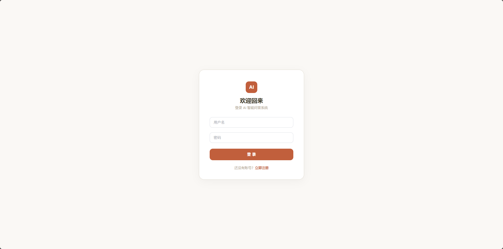
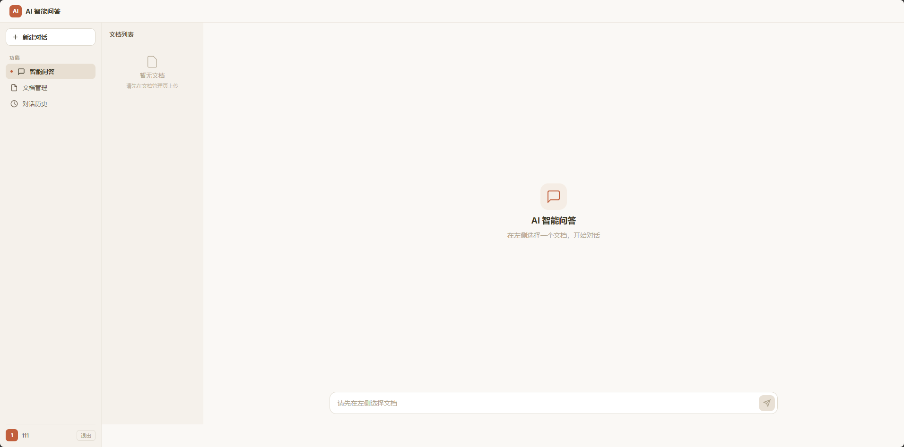
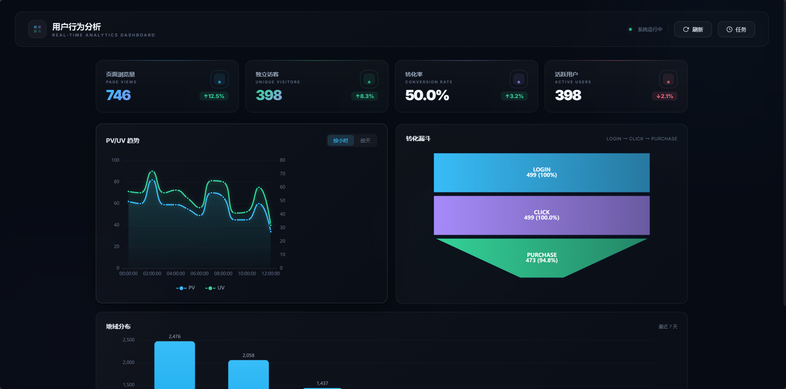
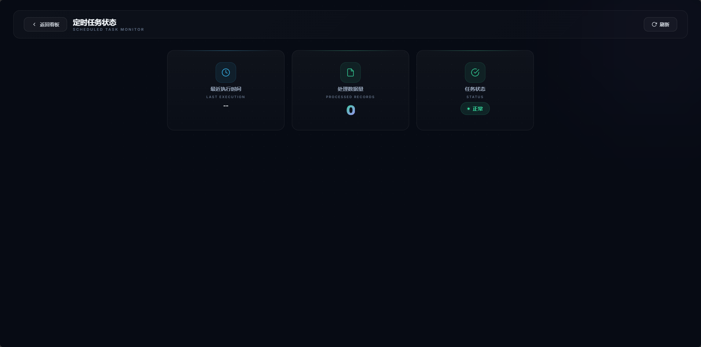

# Java 全栈项目集

两个独立开发的 Java 全栈项目，Docker 一键部署，已上线阿里云。

---

## 项目一：AI 智能问答系统

基于通义千问大模型的文档问答系统，上传 PDF/TXT 后与 AI 进行基于文档内容的对话。

**技术栈：** Spring Boot + Vue 3 + Element Plus + MySQL + Redis + 通义千问 API + Docker

**功能：**
- JWT 认证，注册/登录
- PDF/TXT 文档上传与解析
- 多文档独立对话，切换文档保留各自上下文
- 多轮对话记忆（最近 6 轮上下文）
- SSE 流式输出
- 对话历史按文档分组 + 批量删除

**在线演示：** http://114.55.98.103/




---

## 项目二：用户行为分析仪表盘

前端埋点 + 数据采集 + 可视化看板，完整数据分析系统。

**技术栈：** Spring Boot + Vue 3 + ECharts + MySQL + Redis + Docker

**功能：**
- 前端埋点 SDK（tracker.js），sendBeacon API 上报
- PV/UV 实时统计（Redis）
- 定时数据聚合（Spring Task）
- 转化漏斗、地域分布、PV/UV 趋势图
- ECharts 暗色主题，玻璃态卡片设计

**在线演示：** http://114.55.98.103/dashboard/




---

## 快速启动

```bash
# AI 问答系统
cd ai-qa-system
docker compose up -d

# 仪表盘
cd user-behavior-dashboard
docker compose up -d
```

**环境：** Docker、Docker Compose、Java 17、Node 20

---

## API 接口

### AI 问答系统

| 接口 | 方法 | 说明 |
|------|------|------|
| /api/auth/register | POST | 注册 |
| /api/auth/login | POST | 登录 |
| /api/documents/upload | POST | 上传文档 |
| /api/documents/list | GET | 文档列表 |
| /api/documents/{id} | DELETE | 删除文档 |
| /api/chat/stream | GET | 流式问答（SSE） |
| /api/chat/history | GET | 对话历史 |
| /api/chat/history/{id} | DELETE | 删除历史 |

### 仪表盘

| 接口 | 方法 | 说明 |
|------|------|------|
| /api/track | POST | 接收埋点 |
| /api/stats/pv-uv | GET | PV/UV 趋势 |
| /api/stats/funnel | GET | 转化漏斗 |
| /api/stats/region | GET | 地域分布 |
| /api/realtime/overview | GET | 实时概览 |
