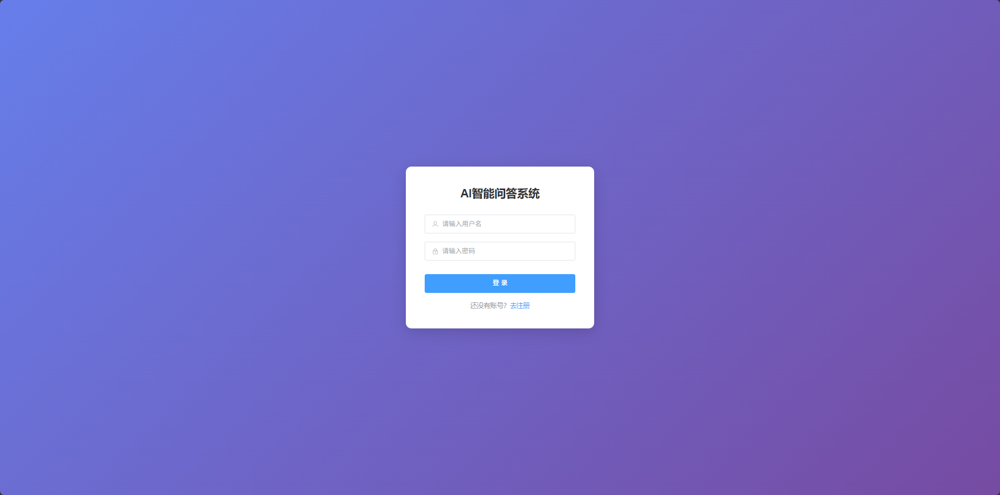
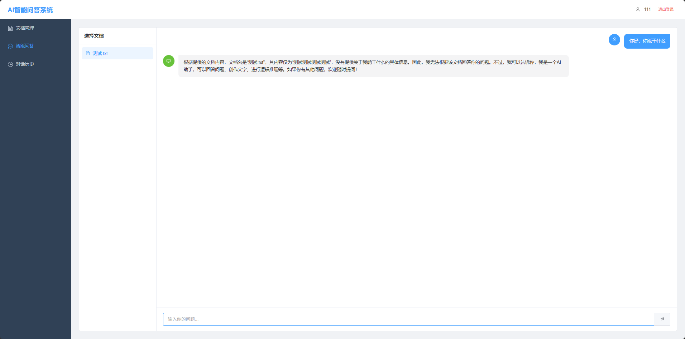
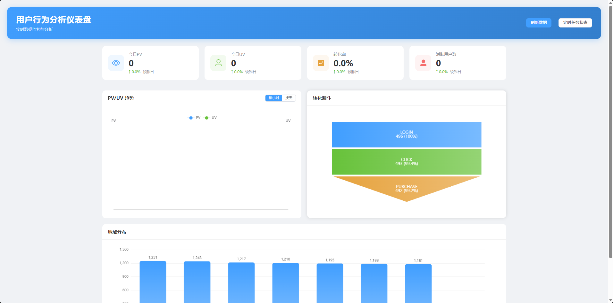
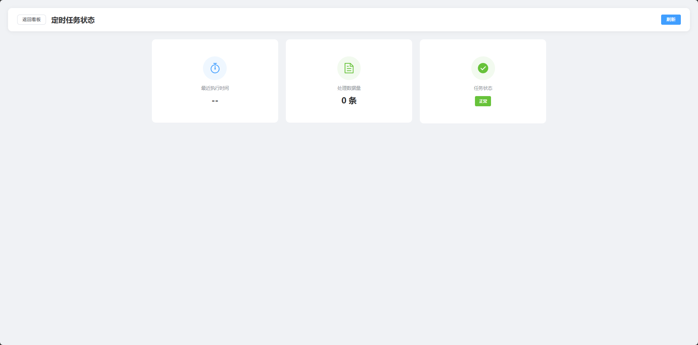

# Java 全栈项目集

两个独立开发的 Java 全栈项目，均已部署至阿里云，公网可访问。

---

## 项目一：AI 智能问答系统

基于大模型 API 的文档问答系统，上传 PDF/TXT 文档后可与 AI 进行基于文档内容的对话。

**技术栈：** Spring Boot + Vue 3 + Element Plus + MySQL + Redis + 通义千问 API + Docker

**功能：**
- 用户注册/登录（JWT 无状态认证）
- PDF/TXT 文档上传与自动解析
- 基于文档内容的智能问答
- SSE 流式输出，逐字返回
- 对话历史记录

**在线演示：** http://114.55.98.103/




---

## 项目二：用户行为分析仪表盘

前端埋点 + 数据采集 + 可视化看板的完整数据分析系统。

**技术栈：** Spring Boot + Vue 3 + ECharts + MySQL + Redis + Docker

**功能：**
- 前端埋点 SDK（tracker.js），基于 sendBeacon API
- PV/UV 实时统计（Redis Set + String）
- Spring Task 定时数据聚合
- 转化漏斗、地域分布、趋势图等多维度可视化
- 10000+ 条模拟数据生成

**在线演示：** http://114.55.98.103/dashboard/




---

## 快速部署

```bash
# 项目一
cd ai-qa-system
docker-compose up -d

# 项目二
cd user-behavior-dashboard
docker-compose up -d
```

**环境要求：** Docker、Docker Compose、Java 17、Node 20

**数据库：** MySQL（自动初始化建表），账号 root / 123456

---

## API 接口

### AI 问答系统

| 接口 | 方法 | 说明 |
|------|------|------|
| /api/auth/register | POST | 用户注册 |
| /api/auth/login | POST | 用户登录 |
| /api/documents/upload | POST | 上传文档 |
| /api/documents/list | GET | 文档列表 |
| /api/documents/{id} | DELETE | 删除文档 |
| /api/chat/ask | POST | 普通问答 |
| /api/chat/stream | GET | 流式问答（SSE） |
| /api/chat/history | GET | 对话历史 |

### 仪表盘

| 接口 | 方法 | 说明 |
|------|------|------|
| /api/track | POST | 接收埋点数据 |
| /api/stats/pv-uv | GET | PV/UV 趋势 |
| /api/stats/funnel | GET | 转化漏斗 |
| /api/stats/region | GET | 地域分布 |
| /api/realtime/overview | GET | 实时概览 |
